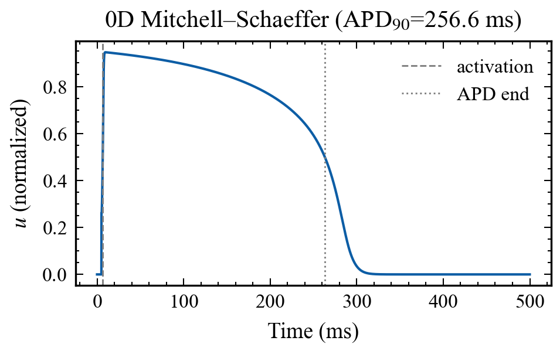
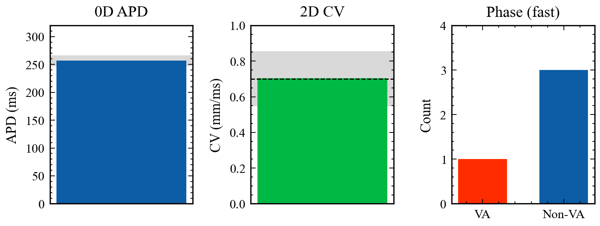
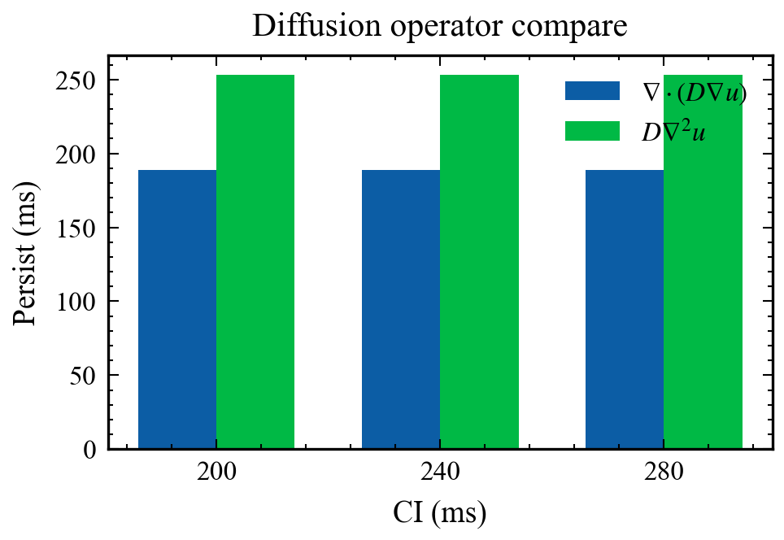
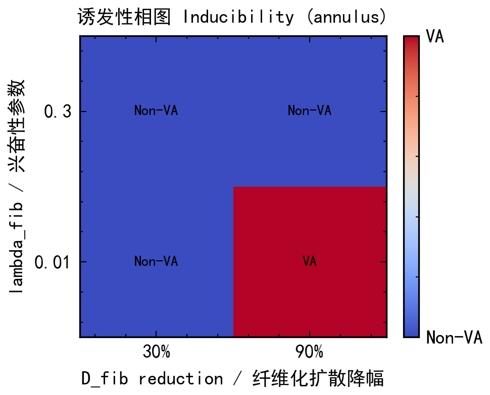
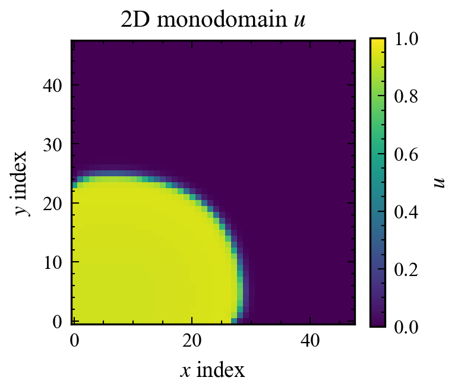

# An open 2D monodomain scaffold for doxorubicin-fibrosis reentry protocols
# 面向阿霉素纤维化折返协议的开放二维单域脚手架

> **nature-writing axes:** `task=manuscript` · `paper_type=methods` · `sections=abstract,intro,method,experiments,discussion` · `language=zh-to-en (working draft ZH + EN title/abstract)` · `journal=generic`  
> **Draft status:** skeleton — Methods/Results filled from local evidence; Discussion framed honestly. Not submission-ready English polish.

---

## Title (EN)

**An open, wavelength-aware 2D monodomain Mitchell–Schaeffer scaffold for reproducible fibrosis–reentry protocols when 3D LBM–GPU digital-twin code is unavailable**

## 标题（中）

**在三维 LBM–GPU 数字孪生源码不可用时：面向纤维化–折返协议复现的波长感知二维单域 Mitchell–Schaeffer 开放脚手架**

---

## Abstract (EN)

Doxorubicin (DOX)–associated diffuse fibrosis can create an arrhythmogenic substrate, and recent cardiac digital-twin work has used personalized 3D MRI-based left-ventricular models with a modified Mitchell–Schaeffer (MS) model and a GPU Lattice–Boltzmann (LBM) monodomain solver to map inducibility under fibrotic excitability and conduction changes. When that solver is not publicly available, independent groups cannot reproduce the computational protocol or stress-test the arrhythmia endpoint. Here we provide an open CPU 2D finite-difference monodomain scaffold that implements the same modified MS ionic law (including λ), conservative diffusion \(\nabla\cdot(D\nabla u)\), three-class synthetic fibrosis tissue, and an S1–S2 stimulation train aligned with published coupling intervals. We calibrate homogeneous conduction velocity to approximately 0.70 mm/ms, enforce CFL-aware time steps, and introduce a **cycle-required** ventricular-arrhythmia (VA) classifier that rejects plateau persistence and single-lap activations as false positives. Because healthy wavelength (~175 mm) exceeds small disc domains (~24 mm), we use a pinned annulus whose path length (~107 mm) sits between healthy and strongly slowed wavelengths, recovering a mixed VA / Non-VA phase diagram at healthy \(\tau_{\mathrm{close}}\). The scaffold is a methods and verification resource, not a 3D DOX twin, and does not claim LBM–GPU performance.

**Keywords:** cardiac electrophysiology; Mitchell–Schaeffer; monodomain; fibrosis; reentry; reproducibility; doxorubicin (protocol alignment)

---

## 摘要（中，工作稿）

阿霉素相关弥漫纤维化可构成致心律失常基质。近期数字孪生研究用 MRI 个性化三维左室、修正 Mitchell–Schaeffer（含 λ）与 GPU 格子 Boltzmann（LBM）单域求解器，在纤维化兴奋性与传导改变下扫描诱发性。当该求解器源码不可用时，独立组难以复现协议并压力测试心律失常终点。本文提供开放的 CPU 二维有限差分单域脚手架：实现同一修正 MS、守恒扩散 \(\nabla\cdot(D\nabla u)\)、合成三相纤维化组织，以及与文献耦合间期对齐的 S1–S2 方案。均匀组织传导速度标定至约 0.70 mm/ms，时间步受 CFL 约束，并引入**要求再兴奋周期**的 VA 分类器，以排除平台期滞留与单圈假阳性。因健康波长（约 175 mm）远大于小圆盘域（约 24 mm），默认采用钉扎环（路径约 107 mm），在健康 \(\tau_{\mathrm{close}}\) 下得到混合 VA/Non-VA 相图。本工作是方法与验证资源，**不是**三维 DOX 孪生，也**不**声称 LBM–GPU 性能。

---

## 1. Introduction（骨架）

**Context.** 化疗相关心毒性不仅表现为射血分数下降，组织改变也可形成室性心律失常（VA）基质。Villar-Valero 等（STACOM 2024；*J Physiol* 2025）用猪 MRI 纤维化左室构建个性化孪生，并在 λ 与扩散参数空间做诱发扫描。

**Gap.** Chabiniok & Zaha 评述强调：若方法不能“打开”（可复现、可本地运行、可个性化），则临床转化受限。当前阻塞包括：LBM–GPU 求解器源码缺失；小二维圆盘几何与波长不匹配导致全 Non-VA 假阴性；仅用 persist≥1000 ms 会把平台期误判为 VA。

**Approach.** 我们构建可测试的二维单域脚手架，对齐离子模型与刺激协议，修正终点与几何，使相图同时出现 VA 与 Non-VA，并为后续三维/开源求解器对照留下接口。

**Boundary.** 合成纤维化 ≠ DOX 猪心肌 ≠ 缺血性 MI；二维 FD ≠ 三维 LBM。

---

## 2. Related work（要点）

- Villar-Valero et al. 2025 / STACOM 2024（doi:10.1113/jp288819）：3D LGE + 修正 MS + LBM–GPU；96 组参数扫描。  
- Chabiniok & Zaha commentary（doi:10.1113/jp290313）：MS 易个性化、LBM 免网格、GPU 可临床化；下一步需**打开方法**与验证。  
- Campos et al., *Front Physiol* 2024：纤维化表示（cleft vs core/border）改变 VA 形态；openCARP 单域诱发——写作上可仿“建模选择→诱发→形态”阶梯。  
- CardioMat (*Comput Biol Med* 2024)：工具箱式 methods 结构（管线→验证→应用边界）。  
- 经典 MS / Djabella λ 修正；openCARP / MonoAlg3D / Niederer 验证基准（本仓库仅作 P2 指针）。

---

## 3. Methods（骨架，先写）

### 3.1 Task formulation

**输入：** 网格 `(nx,ny,dx)`、健康/纤维化 \(D\) 与 \(\lambda\)、S1–S2 时间表、组织掩膜。  
**输出：** 膜电位场 \(u\)、激活时间、CV、折返标签（VA / Non-VA）、相图 CSV。  
**范围：** 二维单域 CPU；不含双向域、浦肯野、真实纤维场、3D LV、LBM。

### 3.2 Modified Mitchell–Schaeffer with λ

\[
\partial_t u = \nabla\cdot(D\nabla u) + \frac{h\,u(u-\lambda)(u_{\max}-u)}{\tau_{\mathrm{in}}} - \frac{u}{\tau_{\mathrm{out}}} + J_{\mathrm{stim}}
\]

健康默认 \(\lambda=0.01\)；纤维化扫描 \(\lambda\in\{0.01,0.1,0.2,0.3\}\)。λ=0 时与 `finitewave-model-mitchell-schaeffer` 单步一致（单元测试）。

### 3.3 Conservative diffusion and CFL

空间采用面平均 \(D\) 的守恒五点格式；常数 \(D\) 时与 \(D\nabla^2 u\) 一致。显式时间步满足 \(\Delta t\le\Delta x^2/(4D_{\max})\)，并另设离子项上限 \(\Delta t\le 0.1\,\mathrm{ms}\)。

### 3.4 Tissue classes and stimuli

三相组织：健康 / 边界（致密掩膜膨胀）/ 致密纤维化。刺激为区域电压钳窗口。S1：BCL=400 ms，默认 n=3；后续 extras 默认 240/200/190 ms（对齐论文 DOX1 训练）。

### 3.5 Cycle-required VA classification

默认 `require_cycle=True`：仅 `activation_persists_ms≥1000` **不算** VA。需探针 `n_extra_cycles≥1` 或 `n_probes_relapped≥3`。单 CI 平台期负对照写入回归测试。

### 3.6 Wavelength-aware geometry

健康波长 \(\lambda_{\mathrm{wave}}\approx\mathrm{CV}\times\mathrm{APD}\approx 0.70\times250\approx175\,\mathrm{mm}\)。48²×0.5 mm 圆盘直径约 24 mm → 仅作阴性对照。默认钉扎环路径 ≈107 mm，使 D↓90% 波长可落入环内而 D↓30% 不可。

### 3.7 Verification suite

`pytest`（本机 42 passed）、0D APD 黄金回归、均匀 2D CV 带、扩散算子一致性、无纤维化 Non-VA、环相图同时含 VA 与 Non-VA。

### 3.8 Figure generation

全部报告/论文图经 SciencePlots（`science` + `no-latex`）与 Times New Roman 重绘；脚本 `scripts/plot_science.py`，模块 `cardiac_ms/plotting.py`。

---

## 4. Results（骨架）

### 4.1 0D action potential and APD

经典 MS（seed=42）APD₉₀ ≈ **256.6 ms**（容差 ±8 ms）。见图 `papers/figures/fig_ms_0d_ap.pdf`。

### 4.2 Homogeneous 2D conduction velocity

标定 \(D\approx0.0465\,\mathrm{mm}^2/\mathrm{ms}\) 后，均匀片两点 CV 落在 **0.55–0.85 mm/ms**，目标 0.70。汇总见图 `fig_validation_summary`。

### 4.3 Diffusion operator comparison

在可变 \(D\) 场景，`div(D∇u)` 与 `D∇²u` 的激活持续可差数十毫秒；本协议下标签未翻转，但说明捷径在异质 \(D\) 下不可默认。见图 `fig_diffusion_compare`。

### 4.4 Annulus inducibility phase diagram

快速 2×2 环网格（论文 extras，τ_close=150 ms）：**VA 1 / Non-VA 3**，唯一 VA 格点为 λ=0.01 × D↓90%。见图 `fig_phase_diagram`。

### 4.5 Disc negative control and mono2d snapshot

小圆盘预期全 Non-VA（波长不匹配）。均匀二维场快照见 `fig_mono2d_u`。

---

## 5. Discussion（诚实创新陈述）

**我们展示的是：** 可复现开放管线；与文献对齐的离子/协议选择；对折返终点的协议硬化；波长感知几何使相图可解释。

**我们不声称：** “首个 DOX 孪生”；三维猪 LV 定量复现；LBM–GPU 加速；临床 ICD 决策工具。

这与 Chabiniok–Zaha“打开方法、靠近临床可用性”的评述一致：本脚手架降低**协议复现与终点审计**成本，而非替代个性化三维孪生。

**局限（P2/P3）：** 各向异性仍为桩；未做 Niederer/openCARP/MonoAlg3D 交叉；未下载 Zenodo 猪 MI（且 MI≠DOX）；完整 4×3 相图可跑但非本轮强制。

---

## 6. Code and data availability

Public repository: **https://github.com/Coucou2016/DOX-LBM-GPU**  
Local workspace (development): `E:\Projects\20260522-DOX-LBM_GPU`.

Core package `cardiac_ms/`, tests `tests/`, phase diagram `scripts/run_phase_diagram.py`, figures `scripts/plot_science.py`. Curated phase CSV: `papers/data/phase_diagram.csv`. Synthetic JSON metadata under `data/synthetic/` (`.npy` regenerable via `scripts/generate_synthetic_data.py`). External big datasets / MonoAlg3D only as pointers in `data/README.md` (optional local; **not** in the public tree).

Self-contained HTML: `papers/manuscript.html`, `reports/research_report.html`.

---

## Claim–evidence map

| Claim | Evidence | Status |
|-------|----------|--------|
| λ-MS 与包在 λ=0 一致 | 单元测试 | supported |
| 0D APD≈256.6 ms | 黄金回归 + Fig.1 | supported |
| CV≈0.70 mm/ms | 标定脚本 + validation | supported |
| 环相图混合 VA/Non-VA | `phase_diagram.csv` + Fig.3 | supported |
| 周期准则避免平台假阳性 | 新测试 + ASSUMPTIONS | supported |
| 开放可复现优于封闭 LBM | 仓库+pytest | supported (methods) |
| 3D DOX 孪生等价 | — | **not claimed** |

## Assumptions or missing inputs

- 英文全文润色与目标期刊格式（Nat Commun Methods / *J Physiol* Methods 等）尚未选定。  
- ChatGPT 在线文献顾问本轮因浏览器标签无法保持而**未完成对话**；框架由 Cursor 结合公开文献元数据与本地证据起草。  
- 完整 12 格相图与各向异性守恒测试仍属 P2。

## Why this structure

- methods 论文：先 Methods/Results，再回写 Introduction。  
- 创新点放在可审计终点与几何，而非“首个孪生”。  
- 图全部 SciencePlots，便于投稿级替换。
