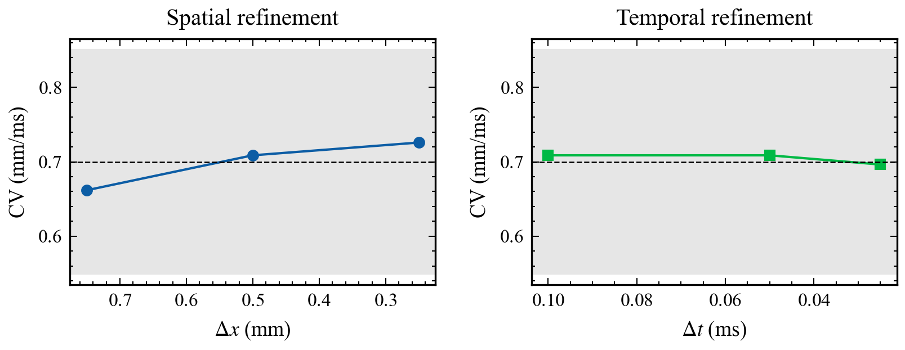
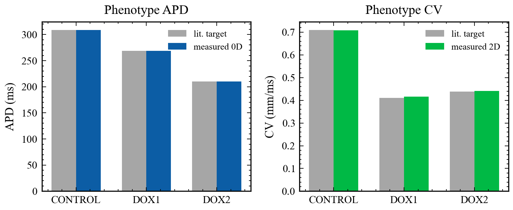

# DOX 纤维化折返协议的开放二维单域脚手架：学术研究报告

生成日期：2026-09-15 · 仓库：Fibrosis-Reentry-MS2D (DOX-LBM-GPU) · 性质：2D 协议/基准研究报告（非临床决策工具）

对照：Villar-Valero et al., J Physiol 2025 (doi:10.1113/jp288819)；Chabiniok & Zaha (doi:10.1113/jp290313)。
相图摘要：VA=3 / Non-VA=9。

## 目录

1. 摘要
2. 背景与目标
3. 数据与方法
4. 研究过程
5. 结果
6. 分析与讨论
7. 结论
8. 局限与展望

## 一、摘要

阿霉素（DOX，doxorubicin）相关弥漫纤维化可构成室性心律失常（VA）基质。
Villar-Valero 等（STACOM 2024 / J Physiol 2026，doi:10.1113/jp288819）用 MRI 个性化三维左室、
修正 Mitchell–Schaeffer（含 λ）与 GPU LBM 单域求解器扫描诱发性。细胞模型/参数/样例解剖公开
（javilva/doxorubicin_fibrosis_model），生产求解器仍专有。Chabiniok & Zaha（doi:10.1113/jp290313）呼吁打开方法。

本仓库提供开放的 CPU 二维有限差分单域协议/基准：对齐修正 MS、守恒扩散
∇·(D∇u)、合成三相纤维化、S1–S2（extras 240/200/190 ms），标定健康 CV≈0.70 mm/ms
（本机均匀片 0.703 mm/ms），
并报告三重 VA 终点（VA_paper / VA_recurrence / VA_strict）。钉扎环为波长设计的验证几何（路径≈107 mm）。
完整 4×3 环相图：VA_paper 1/11，VA_recurrence 3/9，VA_strict 1/11。
0D APD90 黄金回归 256.6 ms。
不是三维 DOX 孪生复现，也不声称 ICD 临床效用。

## 二、背景与目标

### 2.1 背景

研究动机。化疗心毒性传统关注射血分数下降；组织纤维化与电重构亦可形成折返基质。
个性化心脏数字孪生（digital twin）把影像解剖与电生理方程结合，用于虚拟诱发试验，从而在参数空间上追问：
兴奋性、传导与纤维化几何如何共同决定 VA 可诱发性。

Villar-Valero 做了什么。猪 DOX 模型 + MRI/LGE 三维左室；修正 MS（Djabella λ）；
LBM–GPU 单域；对 λ 与扩散做参数扫描（报道约 96 组），报告纤维化底物可诱发恶性 VA。
细胞模型/参数/样例解剖见公开仓库 javilva/doxorubicin_fibrosis_model；生产求解器仍为专有。

Chabiniok–Zaha 强调什么。孪生潜力大，但建模方法与临床落地之间仍有鸿沟；下一步应开放方法、
降低使用门槛，并推进更大规模验证。评述亦指出猪模型 9 周纤维化可能重于典型患者 DOX 毒性——这限制跨物种外推。
ICD 患者选择的临床效用“尚未确立”。

本脚手架的定位。开放二维协议/基准（Fibrosis-Reentry-MS2D）：离子律、刺激协议、
三重 VA 终点（VA_paper/VA_recurrence/VA_strict）、波长–几何一致性与扩散算子诚实性。它回答“协议能否在开放 2D 上被压力测试”，
而不是“能否复现猪 LV 的 LBM 定量结果”。

文献写作架构：
(1) Villar-Valero 2025——参数扫描与 VA 终点主叙事；
(2) Chabiniok & Zaha 评述——转化框架；
(3) Campos 等 Front Physiol 2024（doi:10.3389/fphys.2024.1370795）——纤维化表示→VA 形态；
(4) Sci. Rep. 2024（doi:10.1038/s41598-024-62002-5）——诱导窗/观察窗拆分；
(5) Niederer 2011（doi:10.1098/rsta.2011.0139）——验证文化指针；
(6) 公开细胞模型材料——协议对齐对照。
目标期刊宜偏 methods / 计算生理。

### 2.2 目标

- 实现并验证含 λ 的修正 MS 与守恒二维单域（∇·(D∇u)）。

- 将均匀组织 CV 标定到论文健康纤维向量级（本机 ≈0.703 mm/ms @ D=0.0465）。

- 对齐 S1–S2 与 extras；并列报告三重 VA 终点（paper / recurrence / strict）。

- 用波长感知验证几何（环路径≈107 mm vs 健康波长≈175–180 mm）获得可解释的混合相图。

- 用 SciencePlots 输出可嵌入报告的出版风格图，并生成自包含 HTML/MD/PDF；另附 AUDIT_EVIDENCE 证明数字为本机计算。

## 三、数据与方法

数据。本阶段以合成几何与合成三相纤维化为主；未下载 Zenodo 多 GB 猪 MI 数据
（且 MI≠DOX）。外部求解器 MonoAlg3D 仅作指针。公开仓库：
github.com/Coucou2016/DOX-LBM-GPU（展示名 Fibrosis-Reentry-MS2D）。

方程。单域反应–扩散：
∂t u = ∇·(D∇u) + [h u (u−λ)(u_max−u)]/τ_in − u/τ_out + J_stim；
门控 h 在 u<u_gate 时按 τ_open 开放，否则按 τ_close 关闭。健康 λ=0.01；
纤维化扫描 λ∈{0.01,0.1,0.2,0.3}；环相图 τ_close=150 ms。单位：时间 ms，长度 mm，u/h/λ 无量纲。

数值。显式欧拉 + 面平均 D 的五点守恒扩散（含 Neumann 角点）；CFL：Δt≤Δx²/(4D_max)，另离子上限 0.1 ms。
诱导脚本默认 stimulus_mode=current（亦可 voltage_clamp）。

协议。S1 BCL=400 ms，n=3；extras 默认 240/200/190 ms；诱导窗与观察窗（默认 1000 ms）分离。
VA_paper：persist≥1000 ms 仅此（从不 OR 周期）；VA_recurrence（默认 label）：需 n_extra_cycles≥1 或 n_probes_relapped≥3；VA_strict：persist≥1000 且 再入循环。

几何。圆盘阴性对照（直径≈24 mm ≪ 175 mm）vs 钉扎环验证几何（路径≈106.8 mm）。
完整网格：λ×D 共 12 格，nx=ny=64，dx=0.75 mm。

## 四、研究过程

- P0：修复门控 dt、引入 λ-MS、CV 标定、守恒扩散、S1–S2。

- 发现小圆盘相图全 Non-VA → 波长审计（≈175–180 mm vs 24 mm）。

- 改默认钉扎环；发现平台期假阳性 → 周期必需准则 + 单 CI 负对照测试。

- Round-2/3：三重 VA 终点（paper persist-only / recurrence / strict）；完整 4×3 环相图
VA_paper 1、VA_recurrence 3、VA_strict 1；pytest 57 passed；表型标定 JSON；dx/dt 收敛表。

- SciencePlots 重绘（含收敛与表型面板）；手稿定位为开放 2D 协议/基准；生成自包含 HTML/MD/PDF 与 AUDIT_EVIDENCE。

## 五、结果

### 表1. phase_diagram.csv

| geometry | lambda_fib | d_reduction | label | va | activation_persists_ms | n_extra_cycles | n_probes_relapped | path_mm |
| --- | --- | --- | --- | --- | --- | --- | --- | --- |
| annulus | 0.01 | 0.3 | Non-VA | 0 | 394.60000000000014 | 0 | 0 | 106.81415022205297 |
| annulus | 0.01 | 0.7 | VA | 1 | 666.5999999999999 | 1 | 5 | 106.81415022205297 |
| annulus | 0.01 | 0.9 | VA | 1 | 1000.0 | 2 | 9 | 106.81415022205297 |
| annulus | 0.1 | 0.3 | VA | 1 | 632.5 | 1 | 4 | 106.81415022205297 |
| annulus | 0.1 | 0.7 | Non-VA | 0 | 0.0 | 0 | 0 | 106.81415022205297 |
| annulus | 0.1 | 0.9 | Non-VA | 0 | 0.0 | 0 | 0 | 106.81415022205297 |
| annulus | 0.2 | 0.3 | Non-VA | 0 | 0.0 | 0 | 0 | 106.81415022205297 |
| annulus | 0.2 | 0.7 | Non-VA | 0 | 0.0 | 0 | 0 | 106.81415022205297 |
| annulus | 0.2 | 0.9 | Non-VA | 0 | 0.0 | 0 | 0 | 106.81415022205297 |
| annulus | 0.3 | 0.3 | Non-VA | 0 | 0.0 | 0 | 0 | 106.81415022205297 |
| annulus | 0.3 | 0.7 | Non-VA | 0 | 0.0 | 0 | 0 | 106.81415022205297 |
| annulus | 0.3 | 0.9 | Non-VA | 0 | 0.0 | 0 | 0 | 106.81415022205297 |

### 图1. 经典 Mitchell–Schaeffer 零维动作电位与 APD₉₀

**图注：** seed=42 的 0D 仿真；虚线标出激活时刻与 APD 终点。本机 APD₉₀=256.6 ms。

#### 来龙去脉与读图说明

故事从哪里来：在读 Villar-Valero 等（doi:10.1113/jp288819）的三维 LBM 数字孪生之前，
必须先确认“细胞级离子核”是否站得住。他们与本脚手架都采用修正 Mitchell–Schaeffer
（MS；Mitchell & Schaeffer 2003；Djabella 引入的兴奋性参数 λ）。
零维（0D，zero-dimensional，无空间耦合）仿真把扩散关掉，只看刺激→去极→复极这条时间线，
因此是整条管线最便宜、也最硬的黄金回归点——任何后续 CV / 波长 / 折返争论，若 0D 漂了就失去共同坐标系。

为何画这张图：动作电位时程 APD90
（action potential duration to 90% recovery）直接进入波长设计式
λwave≈CV×APD。几何节用名义 APD=250 ms 估算健康波长≈175 mm；
本图给出可回归的实测 0D APD（256.6 ms），两者必须分开报告，不能混用。

面板怎么读（教师逐步）：

横轴：时间（ms）；纵轴：归一化膜电位 u（无量纲，不是 mV，也不是实验贴附电位）。
上升沿：刺激激活；平台与复极：共同决定 APD90。
虚线：激活时刻与 APD 终点标记；本机黄金回归 256.6 ms（容差 ±8 ms）。
seed=42：保证演示可复现，不是生物学重复，也不是蒙特卡洛置信区间。
与 λ 扫描的关系：本图是经典 MS（λ=0 对照族）时程；纤维化格子上的 λ>0 会抬高内向电流阈值，
但不改变“先钉死 0D 核再谈空间”的验证顺序。

常见误读：(1) 把这条曲线当成“已经证明折返”——0D 没有空间，谈不上折返；
(2) 把 256.6 ms 直接代入三维猪 LV 声称“复现论文 APD”——论文用成像校准，本图只锁脚手架离子核。

与论文/评述的对话：Chabiniok & Zaha（doi:10.1113/jp290313）强调 MS 便于个性化；
我们这里先做的是更低一层的可测一致性：与 finitewave MS 包单步对齐，再进入二维。

结论：0D 端与参考 MS 包一致，为后续二维 CV 标定、波长估计与折返协议提供可信离子核。

### 图2. 验证汇总：0D APD、均匀 2D CV、三重 VA 终点计数

**图注：** 灰带为预设可接受带宽；CV 目标线 0.70 mm/ms；右栏为 VA_paper / VA_recurrence / VA_strict（1 / 3 / 1，分母 12）。

#### 来龙去脉与读图说明

故事从哪里来：方法学论文的可信度不来自单点“好看”，而来自多闸门同时闭合。
对本脚手架，至少需要三块独立证据：(1) 离子时程（0D APD）；(2) 健康传导速度量级（均匀 2D CV）；
(3) 相图能同时给出 VA 与 Non-VA（说明终点+几何没有塌缩成全阴/全阳）。
任何一块单独通过都不够——例如 CV 对了但终点过松，仍会把平台期算成 VA。

为何画这张图：把三项验证压成一眼可读的总览，方便答辩/组会先回答
“脚手架有没有跑通到量级正确”，再进入单张机制图与 CSV 细表。它对应 Niederer 2011
（doi:10.1098/rsta.2011.0139）所倡导的验证文化的轻量本地版：不是 N-version 组织基准，
而是协议局部闸门。

面板怎么读（教师逐步）：

左栏（0D APD）：灰带为预设可接受带宽；点应落在带内（256.6 ms）。
中栏（均匀 2D CV）：灰带 0.55–0.85 mm/ms；虚线目标 0.70 mm/ms
（数值上对应论文健康纤维向量级 ≈0.7 m/s）。标定实测 0.703125 mm/ms @
D=0.0465 mm²/ms。
右栏（三重终点）：同一 12 格上并列
VA_paper=1、VA_recurrence=3、VA_strict=1
（分母均为 12；表为 VA/Non-VA = 1/11、3/9、1/11）。
若只看 persist≥1000，会漏掉两格“再入但未满 1000 ms”的 recurrence 阳性；
若把周期 OR 进 paper 终点，则会把不同准则混成一个数。

常见误读：把“灰带内”理解成临床精度或猪心拟合优度。这里是方法学量级锚定，
服务协议复现，不是影像–模型个性化误差条。

结论：离子时程、健康纤维向量级 CV、以及可区分的三重终点计数三者同屏成立；
随后各图是对这三闸门的展开说明。

### 图3. 均匀组织 CV 的空间/时间收敛

**图注：** 左：Δx∈{0.75,0.5,0.25} mm；右：Δt∈{0.1,0.05,0.025} ms。灰带 0.55–0.85 mm/ms。数值来自本仓库 dx/dt 收敛表（均匀片 CV，不重标 VA）。

#### 来龙去脉与读图说明

故事从哪里来：CV 是波长估计 λwave≈CV×APD 的一半输入。
若 CV 随网格/时间步剧烈漂移，后续“环路径能否放下一个波长”的论证就失去数值根基。
因此在宣称环验证几何之前，必须先展示均匀组织 CV 对 Δx、Δt 的敏感性——这是验证文化（Niederer 2011；openCARP 分辨率例程）的本地轻量版。

为何画这张图：把 dx_convergence.csv 与 dt_convergence.csv 变成可审阅面板，
明确告诉读者：相图默认用 Δx=0.75 mm，而标定常用 Δx=0.5 mm；两者 CV 都落在 0.55–0.85 带内，
但数值并不逐位相同，不能混用。

面板怎么读（教师逐步）：

左栏（空间）：Δx=0.75/0.5/0.25 mm → CV≈0.662 / 0.709 / 0.726 mm/ms。
加密网格 CV 略升，符合显式 FD 常见趋势；三条均在灰带内。
右栏（时间）：固定 Δx=0.5 mm，Δt=0.1/0.05/0.025 ms → CV≈0.709 / 0.709 / 0.696 mm/ms。
时间细化未推出带外。
灰带=方法学接受带；虚线=0.70 mm/ms 标称目标。
本扫不做 VA 重分类：CSV 注释写明 VA 标签仍以默认环相图（dx=0.75）为准。

常见误读：“CV 变了 = 相图假”。相图在固定协议网格上自洽；收敛图回答的是数值敏感性，不是生物学剂量反应。

结论：均匀 CV 在所测 Δx/Δt 范围内保持量级正确，支持用 CV×APD 做波长–几何审计。

### 图4. CONTROL/DOX1/DOX2 表型标定：文献目标 vs 本机实测

**图注：** 灰色=文献 APD/CV 目标（Villar-Valero 锚点）；彩色=本机标定测量。匹配容差 ±10%。

#### 来龙去脉与读图说明

故事从哪里来：Villar-Valero 报告 CONTROL/DOX1/DOX2 的健康 APD 与纤维方向 CV 作为成像校准锚点
（例如 CONTROL APD 309 ms、CV 0.71 mm/ms）。本脚手架若要对齐“协议要素”，
需要证明：在修正 MS 参数空间内，可以把 τ_close 与 D 拟合到这些文献目标附近——
同时诚实声明：拟合出的参数是模型参数，不是论文常数抄录。

为何画这张图：把“目标 vs 实测”并排，避免读者把预设 tau_close=150（环相图常用）
误当成 CONTROL 文献 APD。环相图与表型标定是两条相关但不同的实验轨。

面板怎么读（教师逐步）：

左：APD——灰柱=文献目标，蓝柱=本机 0D 实测。CONTROL 309.0、DOX1 269.0、DOX2 210.1 ms。
右：CV——灰柱=文献目标，橙柱=本机均匀 2D 实测。CONTROL 0.709、DOX1 0.417、DOX2 0.441 mm/ms。
接受规则：±10% 且 CFL 稳定；JSON 中 apd_matched_0d / cv_matched 均为 true。
禁止把这些柱高写成“我们复现了三维猪 LV 诱发性比例”——那是另一篇论文的结果表，本仓库从未运行其 LBM。

结论：表型锚点可在本开放 FD 脚手架上标定到容差内；文献数字只作目标，本机数字来自 phenotype_calibration.json。

### 图5. 钉扎环 λ_fib × D_fib 诱发性相图（默认 VA_recurrence）

**图注：** 暖色=VA，冷色=Non-VA；完整 4×3 为 VA_recurrence 3 / Non-VA 9。

#### 来龙去脉与读图说明

故事从哪里来：Villar-Valero 在三维个性化左室上对 λ 与传导做参数扫描（约 96 组）。
本图是同一科学问题在开放二维脚手架上的最小可解释对应物：不是复现猪 LV 定量诱发比例，
而是检验“终点 + 几何 + 离子/扩散参数”能否给出机制可讲的混合相图，从而让第三方审计协议。

为何默认是钉扎环而不是论文式小圆盘：
健康 λwave≈0.70×250≈175 mm；48²×0.5 mm 圆盘直径约 24 mm，
几何上几乎必然全 Non-VA（作为阴性对照有用，但不适合当主相图）。钉扎环平均路径约 107 mm
（CSV 中 path_mm≈106.8），夹在健康波长与强减速波长之间，才可能出现混合标签。
这是波长–几何一致性问题，不是“调参出阳性”。

面板怎么读（教师逐步）：

横轴：纤维化区扩散降幅 Dfib reduction（传导变慢；0.3/0.7/0.9 对应降 30/70/90%）。
纵轴：兴奋性参数 λfib（抬高内向电流阈值；健康 0.01，0.3 近功能阻滞）。
暖色=VA，冷色=Non-VA；热图默认标签=VA_recurrence：完整 4×3 为 3 / 9。
三重终点对照（同 12 格）：VA_paper=1，VA_recurrence=3，VA_strict=1。
VA 格点（务必对照表1）：λ=0.01×D↓70%（persist 666.6 ms，extra=1，relapped=5）→ recurrence 阳、paper 阴；
λ=0.01×D↓90%（persist 1000 ms，extra=2，relapped=9）→ 三者皆阳；
λ=0.1×D↓30%（persist 632.5 ms，extra=1，relapped=4）→ 仅 recurrence 阳。
λ≥0.2 全 Non-VA——可作机制讨论素材，禁止外推为猪 LV 或临床 DOX 的定量规律。

与表1 对照：读图必须同时看 n_extra_cycles /
n_probes_relapped 与三列终点。仅 persist≥1000 ms 会把平台滞留判成 VA。
本环相图只证明二维协议可审计，不是 3D maze 走廊的定量复现。

结论：在要求再兴奋周期的 VA 准则下，完整相图是机制可解释的混合结果（recurrence 3/9），
而终点审计显示 paper/strict 更严（1/11）；创新点在终点与几何硬化，不在“发现新致心律失常药物机制”。

### 图6. 扩散算子对照：∇·(D∇u) 与 D∇²u 的激活持续

**图注：** 异质 D 下捷径算子可改变 persist（本协议约差 65 ms），标签未必翻转。

#### 来龙去脉与读图说明

故事从哪里来：单域方程的扩散项在数学上应是守恒形式 ∇·(D∇u)。
许多原型代码在均匀 D 时写 D∇²u 没问题（此时两者等价），但一旦 D 空间变化（纤维化降导），
捷径算子会引入非守恒误差，可能改变局部电紧张电流与激活持续。纤维化相图正好是异质 D 场景，
因此必须把算子选择写成方法学声明，而不是实现细节。

为何画这张图：把“数值诚实性”做成可看证据：异质 D 下两算子的 persist 是否一致；
标签会不会翻转。这不是炫技，而是告诉审稿人/合作者：我们默认用守恒格式，并量化捷径风险。
它与 CV 标定、VA 终点并列，属于 reproducibility 证据链的一环。

面板怎么读（教师逐步）：

分组柱：不同耦合间期 CI（coupling interval）——早搏越早，传导越脆弱，算子误差更容易被放大。
比较量：激活持续时长 persist（ms），不是 L2 空间误差范数；选择 persist 是因为下游 VA 规则会读它。
观察：本协议 persist 可差约 65 ms；标签未翻转——说明终点有时对算子误差不敏感，
但不能据此声称捷径永远安全。
与 CFL 的关系：显式格式还受 Δt≤Δx²/(4D_max) 与离子上限 0.1 ms 约束；算子错误与稳定条件是两件不同的事。

常见误读：“标签没翻 = 两算子等价”。不等价；只是本网格/本终点下未跨过分类阈值。
换观察窗、换几何或换 require_cycle 规则后，差异可能变成标签翻转。

结论：脚手架默认守恒扩散；对照实验保留为异质介质下的数值诚实性证据，并写入 ASSUMPTIONS。

### 图7. 均匀二维单域膜电位场快照

**图注：** 修正 MS、无纤维化短时程仿真终态 u 场（烟雾测试，非折返证据）。

#### 来龙去脉与读图说明

故事从哪里来：读者在看完 0D 与相图后，仍可能怀疑“二维求解器是否真的在空间上传波”，
或者误以为相图只是标量脚本。本快照给出最短的视觉确认：均匀组织、无纤维化、短时程终态的膜电位场。

为何画这张图：它是管线烟雾测试（smoke test）的空间证据，
证明 ms_2d 求解器在跑，而不是只输出 CSV 标量。对 methods 论文而言，
“能看见场”降低了审稿人对黑箱指标的不信任，但不能单独承担科学结论。

面板怎么读（教师逐步）：

颜色：归一化膜电位 u∈[0,1]（与 0D 图同一无量纲约定）。
几何：均匀二维单域；本图无纤维化掩膜、无钉扎孔——因此看不到环上折返结构是正常的。
时相：短时程终态快照——用于可视检查，不是 S1–S2 诱发协议的观察窗截图。
与相图的分工：相图回答“参数格子上 VA 是否发生”；本图只回答“空间求解器是否在传波”。

严禁过度解读：本图不是折返阳性证据，也不能替代 S1–S2 + 周期准则 + 相图。
若只展示漂亮的 u 场却不做终点硬化，会重复早期“平台期假阳性”陷阱，也会与 Chabiniok–Zaha
“打开方法”的精神相反——打开方法要求终点可审计，而不是图像好看。

结论：2D 求解器可运行；折返结论必须以协议分类与相图（表1 + 图5）为准。

## 六、分析与讨论

与 Villar-Valero 的关系。共享：修正 MS+λ、单域思想、纤维化参数扫描、S1–S2 诱发逻辑。
不共享：3D 猪 LV、LBM–GPU、真实 LGE 纤维化分布。因此创新点应表述为
开放可测的协议基准与终点/几何硬化，而非“首个 DOX 孪生”。

与 Chabiniok–Zaha 的关系。评述呼吁打开方法；本仓库以 CPU、pytest、文档化假设、公开 GitHub
响应“可复现入口”，但尚未提供临床 GUI。猪 9 周纤维化偏重的提醒，
进一步禁止把二维环相图写成患者风险工具。

为何二维不应复现三维诱发性图。健康波长≈175 mm；D↓90% 波长≈55 mm；λ=0.2/0.3 近阻滞。
环路径≈107 mm 上的混合标签由波长–几何决定，而非 3D maze 走廊——差异是维度与几何边界，不是标定失败。

平台期 vs 真折返。完整 CSV 中，VA 格点可有 persist<1000 但 extra≥1；
反之，平台滞留可 persist≥1000 而 extra=0 → VA_recurrence=Non-VA / VA_paper=VA；
再入而 persist<1000 → VA_recurrence=VA / VA_paper=Non-VA。终点定义必须写进方法学。

## 七、结论

- 开放 2D 修正 MS 单域协议/基准可在无生产 LBM 求解器时对齐关键协议要素。

- CV≈0.70 mm/ms 与 0D APD=256.6 ms 黄金回归提供量级锚定。

- 三重 VA 终点使文献 persist-only、再入循环与严格合取规则可并列审计。

- 波长感知环验证几何恢复混合相图（VA_recurrence 3 / Non-VA 9；VA_paper 1；VA_strict 1）。

- 工作边界清晰：非 3D LBM、非猪 DOX 数据复现、非临床 ICD 工具。

## 八、局限与展望

- 二维 FD ≠ 三维 LBM；无真实纤维场 / Purkinje / 双向域。

- 合成纤维化 ≠ DOX 猪心肌 ≠ 缺血性 MI（公开 MI 数据亦不能直接当作 DOX）。

- Niederer/openCARP/MonoAlg3D 交叉验证仍为后续工作；圆盘几何完整定量 CSV 可按需再生。

- DOX 表型 1D CV 尚未在本 FD 脚手架上完全匹配文献目标（已在 phenotypes 中注明）。

- 各向异性传导仍为原型实现。

